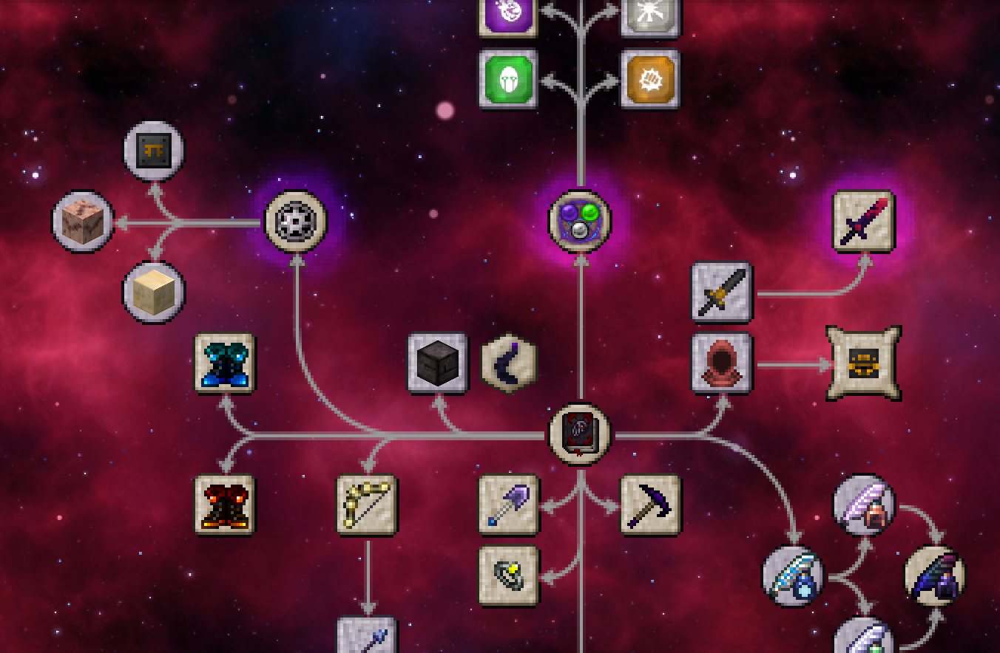
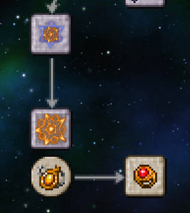

# New Crimson Revelations

**New Crimson Revelations** is a content addon for Thaumcraft 6 focused on adding more Crimson Cult related content to expand the lore and make the overall mod feel more complete and polished. This also serves as an unofficial continuation of the original Crimson Revelations mod by MobiusFlip, with most content of that mod intact and longtime issues fixed.

To access most of the new content, you'll need to unlock **The Crimson Cult** research by scanning a cultist and also obtain a Crimson Rites book dropped by them, you'll need it to fully unlock **The Crimson Rites** research. Once these are done, the Revelations category will immediately unlock and you can finally start progressing throughout the addon.

---

## Main Content

Configurable items can be toggled off if they are unwanted. All sets here are also dyeable!

- **Axe of Execution:** A heavy weapon of everlasting fire that can burn your foes, smelt chopped blocks, and behead slain creatures!
- **Boots of the Comet:** Upgraded Boots of the Traveler. Walk on water to temporarily freeze it to Frosted Ice like vanilla's Frost Walker enchantment. 
- **Bestiary:** Learn more about the lore of cult members scanned by your thaumometer!
- **Crimson Archer:** A new cultist spawned from Lesser Crimson Portals, they will fire arrows and strife like skeletons.
- **Crimson Archer Set:** Armor worn by the cult's archers, pieces can be dropped by the archers themselves or crafted.
- **Crimson Cult Materials:** New drops from the Crimson Cult used throughout the mod (Crimson Fabric and Crimson Plates).
- **Pickaxe of Warped Distortion (Configurable)**: Mines harder blocks like Obsidian faster but slower on weaker blocks. The particles produced help indicate which blocks can be mined faster.
- **Ring of Nutriment (Configurable):** Restores more hunger when eating food. It also makes you completely immune to starvation damage.
- **Shovel of the Purifier (Configurable):** Destroys flux goo instantly. Sneak and right-click to cleanse yourself from any taint effects like Flux Flu.
- **Thaumic Litmus Paper (Configurable):** Tells you the exact amounts of warp you have.

## Focus Effects

- **Blinding Flash:** Inflicts Blindness and Bluriness, or Weakness to non-player targets. Damage is doubled and armor is pierced against undead targets.
- **Hex:** The original Pech's Curse effect from older Thaumcraft versions.
- **Poison:** Inflicts Poison.
- **Punch:** Deals heavy knockback but at the cost of no damage.

## Golem Materials

- **Crimson Plate:** Contains the best of both Brass and Iron golem materials.
- **Flesh:** Cheaper self-repair.
- **Tallow:** Has no positive or negative golem traits.

## Infusion Enchants

- **Beheading:** Now you can behead creatures with any of your tools!
- **Chameleon:** Gives you the ability to swap enchantment sets!
- **Vis Attunement:** Add a vis discount to any armor pieces you want!

## Scribing Tools

- **Knowledge:** Provides more theories and observations after they are used up. Rechargeable with Sensus vis crystals.
- **Primordial:** Infinite and serves as upgraded versions of both Knowledge and Sanitation.
- **Sanitation:** Provides Warp Ward while removing some temporary and normal warp. Rechargeable with Cognitio vis crystals.
- **Technomancer's:** Instead of ink, these scribing tools utilize vis charge.

## Crafting the Previously Unobtainable

Items that were previously unobtainable or very hard to get in base Thaumcraft can now be obtained via recipes such as alchemy, arcane crafting, or infusion!

- **Crimson Blade**
- **Crimson Cleric Set**
- **Crimson Cult Banner**
- **Crimson Knight Set**
- **Crimson Praetor Set**
- **Manufacturing Ancient Stone:** Ancient Stone, Ancient Stone Tiles, and Glyphed Stone!

## Ported from older Thaumcraft versions

- **Bow of Bone:** Autofires arrows with no extra charge.
- **Boots of the Meteor:** Upgraded Boots of the Traveler. Jump up and sneak in midair to crash down and create a (non-destructive) explosion around you!
- **Ethereal Bloom (Configurable):** Wards away taint around it.
- **Magic Tallow Block**
- **Mana Beans:** They make a return to the Magical Forest's generation. You can harvest beans for their pure aspects or eat them for research points and randomized (configurable) effects.
- **Primal Arrows:** Available in all primal aspects with each one having a special ability.
- **Runic Baubles:** Simple baubles that provide runic shielding.
- **Specialized Runic Baubles:** Upgraded runic baubles that come packaged with extra abilities.
- **Verdant Heart Band:** A ring counterpart to the Verdant Heart Charm in case you want both effects at once.

## Tweaks

Tweaks to Thaumcraft to enhance gameplay. Most of these features should be configurable.

- **Naturally Spawning Furious Zombies:** You can now encounter Furious Zombies on the Overworld's surface in survival!
- **Portal Spawn Particles:** Ported from Thaumcraft 5, portals that spawn cultists will have particles.

## 🔁 Thaumic Augmentation Integration

Requires Thaumic Augmentation to also be installed to access.

- **Ancient Crimson Set:** The armor worn by Shambling Husks, pieces are either dropped by them or found in Eldritch Spires.
- **Crimson Paladin Set:** Armor worn by higher-ranking cultists, pieces are found in Eldritch Spires.
- **Crimson Ranger Set:** Armor worn by higher-ranking cultists, pieces are found in Eldritch Spires.
- **Extra Tainted Lands Spawns:** Adds Taint Swarms and more Taint Seeds in the Tainted Lands of the Emptiness.
- **Overgrown Taintacle:** A miniboss based on the original Giant Taintacle that has a chance to spawn in the Tainted Lands of the Emptiness.
- **Taint Poison Focus Effect:** Ignores armor and infects your foes with taint.

---

## 🙏 Special Thanks

- Originally creating Crimson Revelations (licensed under MIT) and setting up interesting lore for it, which this addon continues from ~ MobiusFlip
- Crimson Archer, Crimson Paladin, and Crimson Ranger armor models, these models also appeared in Thaumic Dyes and Crimson Cult Armory ~ Mr. Damien Hazard
- Massively helping with the lore and providing excellent new models ~ John_Carver
- Being a huge help with the mod and implementing features like the Mana Bean generation ~ ACGaming
- Being a huge help with the mod and implementing features like the Chameleon and Vis Attunement infusion enchantments ~ Invadermonky
- CTM textures for the Magic Tallow Block and other bits of feedback ~ PessiMysterio
- Giving general feedback to early versions of the mod ~ xJon
- Art contributions to early versions of the mod ~ fakeginkgo
- Code contributions to early versions of the mod ~ keletu66666

## 🌐 Translators

- Simplified Chinese ~ fakeginkgo

---

## Licensing

Code from this mod is licensed under GNU General Public License v3 (see LICENSE.txt).

Assets specifically made for this mod are licensed as All Rights Reserved (see LICENSE-ASSETS.txt). Other assets such as ported content from older Thaumcraft versions belong to their respective creators.

---